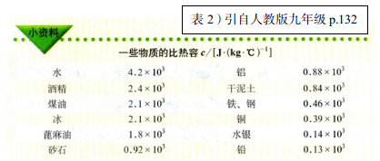

#初中电学也可以这样来复习

**说明：本文是恩师杨大卫教授为中学教师而作。**

---------------------------

八年级（初中二年级）的电学比起前面的声学、光学、热学来，不仅动手实验的内容增加了，而且利用物理量描述物理规律的内容也增加了。物理教科书中自电学始，不仅公式（公式也可以看做函数关系表达式）多了，而且出现了“多变量问题”（截图1）。

图1

虽然，学生在八年级上学期的数学课就已经开始学习“函数”，但是（一）主要是一元函数；（二）并不关注变量的单位。可初中电学

（一）涉及多元函数，例如焦耳定律公式（图3），一个变量Q决定于三个自变量I、R和t，相关的电热演示实验采用的是典型的“控制变量法”； 

图3

（二）函数表达式中的每一个物理量都对单位有严格的要求（截图2），在解题过程中不仅数字要参加运算，单位也要参加运算。

“量”即“多少”或“大小”，它由两部分组成，“数”与“单位”，二者缺一不可。学生解题时，往往只注意数的运算，而忽视单位的运算。另外，面对电学中诸多的物理量（表1），学生经常把不同量的单位相混淆，或者把量的符号与单位的符号相混淆。为防止混淆，教科书中的相关章节，多次出现警示框（截图2、4与5）。

图4

图5

每个量除有主要单位外，还有分数单位与倍数单位。例如，伏、毫伏与千伏；安、毫安、微安；欧、千欧、兆欧； 瓦、毫瓦与千瓦；等等。 　　　

尽管书中多次警示，教师也经常嘱咐，但 对初中生而言，记牢公式、搞清物理量、用对单位，仍非易事。 　　　

**我们是否可以将公式中的各量仅取 1个单位，导出某单位与其他单位的关系，进而了解该单位的物理意义。**

例1.进一步了解能量单位“焦耳”与电功率单位“瓦特”。

图6

由截图6，我们不仅根据公式了解电功率的物理意义，知道了电功率是描述用电器消耗 电能快慢的物理量，而且还可以推得：

    瓦特=焦耳/ 秒    或者     焦耳=瓦特·秒。

前者是说，如果某用电器在1秒内消耗1焦耳的电能，那么它的电功率就是1瓦特；

后者意即，如果用电器的电功率是1瓦特，那么1秒内消耗的电能就是1焦耳。

由于1千瓦· 时=1000瓦特×3600秒=3.6×10^6瓦特·秒=3.6×10^6焦耳，这说明“焦耳”这个单位很小。（说明：10^6代表10的6次方）

表2

那么，1焦耳电能可以做些什么呢？最易懂的实例就是焦耳定律演示实验（截图7），若用1焦耳电能加热液体，仅能使0.24克纯水或0.47克煤油温度上升1℃（见表2）。

图7

例2. 了解电荷量的单位“库仑”与电流的单位“安培”的关系。 　　　

许多初中生，知道电子电荷量的绝对值（元电荷）e约为1.6×10^-19库仑，那么1库仑含多少个电子呢？可能有的学生有些“茫然”。但另一些学生会很快的出答案：

    1库仑 =（1.6×10^-19）^-1 e = 0.6×10^19 e  

0.6×10^19就是600亿亿，这看起来是个大数目，如世界人口数以60亿计，众人携带这些元电荷，则平均每人就有10亿个。可是该数仍小于体积为1立方毫米的铜粒内所含的自由电子数目——10^19（室温下）。由此，可体验铜为什么是电和热的良导体。 　　　

如果电路中的某横截面每秒通过1库仑定向移动的电荷，那么该电流的强弱就是1安培，即 安培=库仑/秒；反之，如果电路中某处横截面的电流是1安培，那么1秒内定向移动通过该处的电荷量就是1库仑，即 

    库仑=安培×秒。    

例3. 了解“伏特”与“焦耳”的关系。 　　　

联系截图5与6，可得 

    焦耳/秒=伏特×安培

，进一步导出： 　　　　　　　　　　　　　

    焦耳=伏特×安培×秒。        

这说明，端电压是1伏特的用电器，如果其中的电流是1安培，那么1秒内消耗的电能就是1焦耳。 　　

又因为库仑=安培×秒（见例2），代入上式可得

    焦耳=伏特×库仑，

即 　　                    

    伏特 = 焦耳 / 库仑。 　　

由此可了解“伏特”的物理意义——如果某电源每搬运1库仑电荷做定向移动时，会把1焦耳其他形式的能转换为电能，那么该电源搬运电荷的能力就是1伏特。 探究“电阻率”的物理意义及其单位。

表3

设表3所列出的长1米、横截面积1平方毫米的某种金属导线在20℃时的电阻值为ρ，该值被称作电阻率。由于在一定温度下，金属导线的电阻R与其长度L成正比，与其横截面积A成反比，所以R= ρ L / A ,由此解得ρ = R A / L ，将其中每个物理量都取1个单位，即可得出ρ的单位是“欧姆·平方毫米/米”。

又因为1平方毫米=10^-6平方米，所以欧姆·平方毫米/米=10^-6欧姆·平方米/米 =10^-6欧姆·米。“欧姆·平方毫米/米”和“欧姆·米”都是电阻率的单位，1欧姆·米=10^6欧姆·平方毫米/米。

