#概念图在课堂教学中的应用实践

说明：此文大约是在2003年写的，并发表在某杂志。今天从新发布，是为了给对思维导图/概念图有兴趣的朋友参考一下。那时候本文作者还是一名高中物理教师。

---------------------------------

作者：齐伟

课堂教学可能在相当的时间内还是学校教育主要形式，所以我们要关注课堂教学的效果和形式。那么概念图以何种方式进入课堂教学之中？能取得什么效果？下面是对这方面进行的探索，请您指正。

##1．整理加工信息的工具

课堂教学中学生、教师、教材都会传达出各种信息，一种有意的学习就要对这些信息进行整理，无序排列的信息对于学习者就是无用的，有序的信息不仅能够增加学习者的知识，还有助于他们进行深刻的思考，从中获得创新的。

###辅助教学设计

教师进行教学设计是完成课堂教学的必备步骤，新课程的教学设计不应该等同于传统的“备课”，传统的“备课”实质上仅仅是“备教材”，然后到课堂上“照本宣科”，新课程要求教师要能够进行“创造性”的教学，也许与课堂教学的内容很多，如何最有效的进行组织设计，如何让学生在获得知识同时发展能力，仅仅是“脑子里”想想就出来教学设计的可能性在信息闭塞的环境中适用，当信息量多且更新速度快的信息时代到来时，概念图就为我们提供了一项管理纷繁信息的技术，教师可以借助它归纳、整理教学思路。如图2所示，是关于高中物理万有引力定律的教学设计，从这个教学设计中可以看出，教学内容和方法都不拘泥于教材，而是根据教材和学生的实际情况，通过接受学习（各种讲座）和发现学习（万有引力定律发现过程的模拟思维过程）的综合运用，教材内容的学习和拓展性的学习（如引力的现代研究等）相结合，达到了培养学生思维能力、开阔视野的目的，特别是在一些安排得当的讲座中，能够在学习基础知识的同时窥视前沿的发展。可以说这里涉及到的内容远远超出了教材的限制，但是由于利用概念将这些教学内容做了井井有条的组织，使得教学设计过程并不复杂，而且使教师清晰的发现教学的重点难点和针对什么内容采用什么教学方法。

概念图在教学设计过程中本质上起到了将原来显现在教师头脑中的教学内容和教学理论、教学经验以可视化的形式表现出来，相当于在虚拟的环境中完成了一次教学过程，诸多的教学元素如同棋盘上的棋子，教师任意调遣，直到排列构造出最佳的阵势，也就完成了最佳的教学设计。

(由于图比较大，这里分割为若干部分，请读者注意看图示箭头方向)

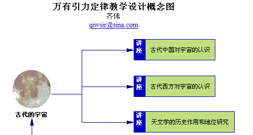

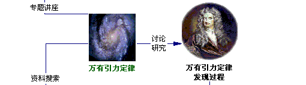

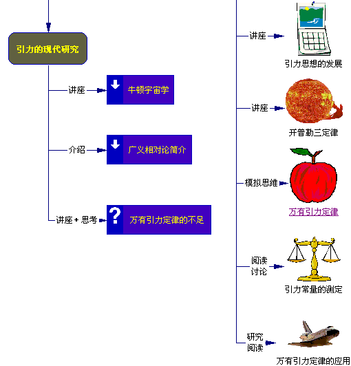

图2“万有引力定律教学设计”概念图

###改革学生笔记形式

有许多教师反应学生在课堂上不做笔记、或者不会做笔记。这里我们不去讨论课堂教学中学生做笔记的必要性，单探索如何更有效的做笔记。传统的笔记是以文字为主的条款罗列形式，这种方式极易造成学生跟不上教师的讲解，或者听和记矛盾，顾此失彼，或者抓不住重点等等。托尼·巴赞用“思维导图”技术改造了这种传统的笔记方法（详见另一文章“走进概念图”）。如图3所示，是学习高中物理“牛顿第一定律”的笔记，由于牛顿第一定律的内容已经为学生所熟悉（初中就已经学习过了，而且便于掌握），在这里这个学生重点记录了对定律的理解，从图中可以看出对牛顿第一定律的理解可以涉及到“力”、“运动”和“惯性”等方面内容，课堂后又对这些概念的进行深入研究， “力和加速度有一定关系：力是产生加速度的原因”，那么按照图示对应的关系，是不是“加速度和质量存在什么关系”呢？这样对课堂学习内容就有了更深刻认识。

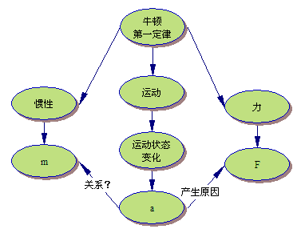

图3“牛顿第一定律笔记”概念图

从上面的例子可以看出这种笔记的方式不仅将概念和对概念的理解迅速的有重点的记录了下来，有利于课后复习和再思考。

###帮助学生找到信息间的联系

学生在学习过程中往往会出现能够理解某个概念的含义，但是面对真实问题的时候就不知道如何运用自己所学知识了，只能够凭猜测或者尝试。出现这种现象的根本原因在于学习的时候没有知识之间关系，机械的记忆了某些概念，但是这些东西在头脑中只是一些无序排列的符号，不能形成系统的有意义的认识。只有将学习过的知识及时的总结，形成有序的结构，找出各个概念间的关系，才能在运用的时候游刃有余，而且从中可以“创造”新的知识。概念图在这方面有比较好的作用，它将原本存在于头脑中的概念知识摆在面前，我们可以通过彼此的位置、连线等观察到知识的联系。如图4所示，是对高中物理“直线运动”和“曲线运动”部分的比较分析，通过描述不同运动形式的物理量和两种运动的基本表现等方面比较了它们的特点，找出了两者的联系和区别，同时也发现了现有知识结构的不完备，为对物体“运动”的认识继续深入发展留下了空间。

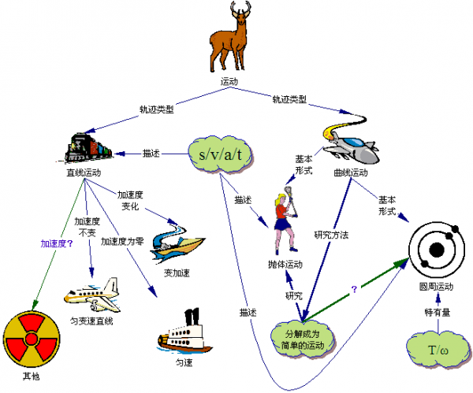

图4“直线运动与曲线运动比较”概念图

###“按图索骥”，协助记忆

在学生的学习过程中，记忆是必不可少的，但是很多情况下他们习惯于简单的机械记忆，这种机械的记忆不仅效率低，而且容易遗忘。借助概念图，将要记忆的内容通过图示的形式表现出来，先根据概念图的流程复述、记忆，不仅是以语言的形式而且也包含了图象的因素同时引入脑海，有助于提高记忆的效率，即使有遗忘，通过对概念图的回忆也非常容易将遗忘的部分重现出来。如图5所示，就是帮助小学生复述故事用的概念图，通过图的导引，学生可以按图索骥进行复述，概念图起到了良好的协助记忆的作用。

图5“希腊神话故事”概念图图5“希腊神话故事”概念图

##2．师生表达知识的工具

“表达自己对知识的理解”是常见的教学行为，我们在实践中体会到借助概念图表达知识不但形象直观，而且简明扼要，特别是能够反应出构图者对知识的独特理解和表达方式。

###教师展示教学内容

传统的展示教学内容方法是罗列条款，这种方式不能给学生以形象的展示，也不能非常直观的发现知识内容间的关系。概念图不是简单的罗列知识点，也是教师对知识理解过程的可视化，学生既能直观的观察到概念，又看到了教师的思维过程。如图6所示，为中学数学“二次多项式”的概念图，通过概念图展示出来了各种表达方式和其特点。

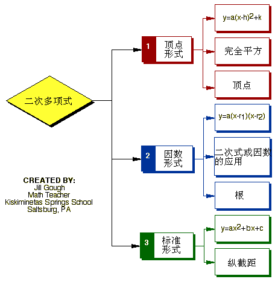

图6“二次多项式”概念图

###学生分析知识结构

在复习课中要经常让学生总结某部分的知识要点，学生往往是按照教材目录将各个章节的内容罗列即算完成作业了，复习的效果不好。我利用概念图改变了这种复习方法，先让他们自己概念图，然后在课堂上以小组为单位讨论每个同学的构图过程和表达的思想，最后由小组代表向全班同学讲解自己的概念图，其他同学还可以对概念图进行补充修改。学生对这样的教学过程表现出来了极高的热情，不论是成绩好还是成绩差的学生都积极参与，最终的概念图常常反应出了学生集体的智慧。如图7所示，是学生对力和运动部分的知识结构分析，从中我们能够了解到这个学生对知识的理解程度，因为采用概念图的形式，修改删减等都非常容易，所以便于学生讨论研究，及时反应每个同学的观点。

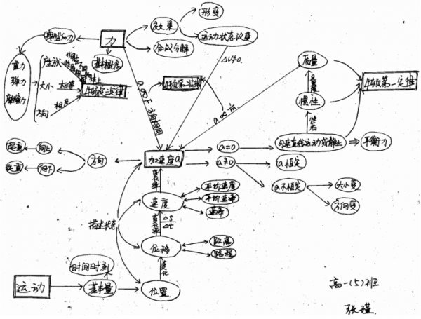

图7学生构建的概念图

##3．学习交流的工具

一般人不愿意阅读大量的文字说明，却对视图材料能够表现出极高的兴趣，在彼此的交流中也是如此，“一图胜千言”，所以概念图还可以用于学习过程中的交流活动。

###远程协作

通过互联网的学习交流目前已经比较普遍，但是多为文本的表达方法，这种表达方法的优点是比较准确，缺点是很多人都不愿意仔细的阅读将文本内容（除了非常重要的文件），只是看看大概而已。这中间的主要问题就是面对海量信息的时候，人们都想尽量多的涉猎，那么概念图就可以满足上网者的这种心理了。如图8所示，为笔者和一个网友在讨论理想的阅读环境时候所做的概念图，这里面是两个人都在概念图里面发表自己的看法，借助概念图传达彼此的思想和对问题的看法，就如同当面谈论一样，它不同于其他的单纯语言传达信息的方式，我们能够非常清晰的看到彼此的观点。

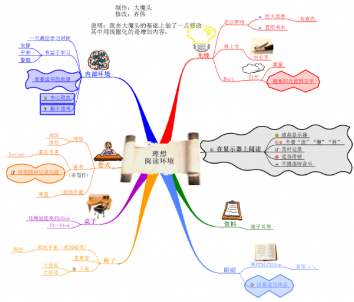

图8“理想阅读环境”概念图

##师生协作

“师不必贤于弟子，弟子不必不如师”，在概念图中这种认识体现的更明显了，因为同时对一个内容的理解，不同的人有不同的看法，教学中如果能够激发学生的创意，使他们表达自己的理解，往往能够收到意想不到的效果，特别是在这个过程中教师和学生的彼此协作，则能够真正实现“教学相长”。如图9所示，就是我在教学过程中，根据学生对“力和运动”部分知识的理解（图7所示），选取了其中的部分内容，然后结合自己的理解进行了重新的组织，那么这张图就是集中了师生的智慧，之后又把这个概念图发送给了学生，使学生对这部分知识理解更深刻了。

此外，类似的协作交流还可以在教师与教师、学生与学生之间进行，都类似与前两者，能够集思广益。

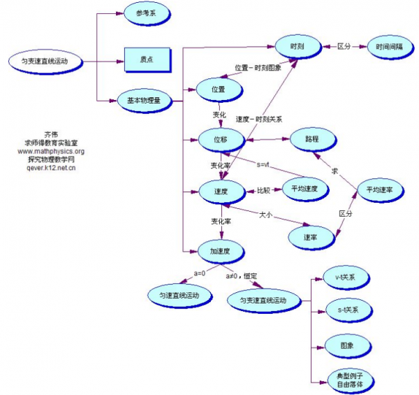

图9师生共同构造的概念图

##4．师生在教学活动中进行反思的工具

教学反思是教师提高教学素质的有效方法，传统的做法是将教学内容在脑子里面转一转，想一想，或者将部分内容写一写，这些方法的深入有效性值得怀疑，因为教学中的因素很多，仅仅就知识来讲，一堂科上可能师生学习的内容有限，但是这些知识在整个知识体系中占有什么位置？和其他知识之间又什么关系，作为学生如何将课堂上的内容进行有效的拓展？面对这么多的问题我们如何“想一想”就能反思的？如图10所示，就是我在进行了“电阻测量”教学后，所做的反思总结，从中发现了更多的测量方法。

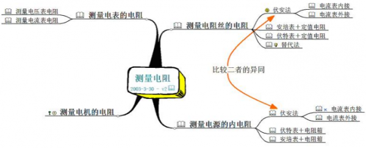

图10“测量电阻”概念图

##5．实现高级思维的工具

###讨论问题的“聚合器”

讨论问题是我们在工作学习中经常进行的，特别是在备课过程中，教师们都要阐述自己对问题的理解。然而有一个总让我们头疼且很难避免的问题就是“跑题”，由于某个原因就可能谈及其他了。概念图能够在最大限度避免这种情况。因为我们可以将不同发言人的观点及时的记录下来，这样大家都面对同一张图，能够知道现在所关注的焦点问题，从而围绕它展开讨论，并且讨论之后及时形成都接受的决议，分别复制给大家，可以非常快速而准确的贯彻讨论结果。如图11所示，就是在集体备课过程中教师讨论的结果。教学实践证明，这种技术在集体备课中的应用，可以节省时间、提高效率、增强效果，特别是对新教师的培养起到了非常好的作用。

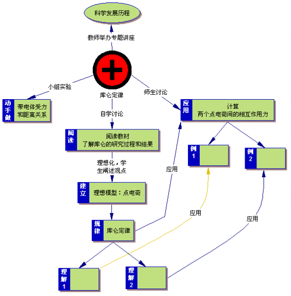

图11“库仑定律教学讨论”概念图

###研究性学习的导向

指导学生进行研究性学习，是教师的责任。但是往往在这个过程中教师和学生都容易失去方向，对已经和正在研究的内容不十分清晰。我们就可以借助于概念图，作为方向的指引，按照图示的各个部分，分别进行研究。图12所示的是“研究菜刀上的力学”所需要的研究内容和步骤，教师按照图示指导，学生按照图示的内容分别进行探索，目标和步骤都非常明确。此外，概念图还可以广泛应用在Webquest的学习方式中，在利用网络进行学习探究的时候，学生容易迷失方向，概念图可以用来导航；面对各种信息如何分检，概念图可以提供思维框架；面对众多的研究头绪从何处入手，概念图可以指点迷津。（详细的内容可以参阅“动态与创造社区http://www.qiusir.com/bbs/”的“思维导图”栏目中的有关帖子）。

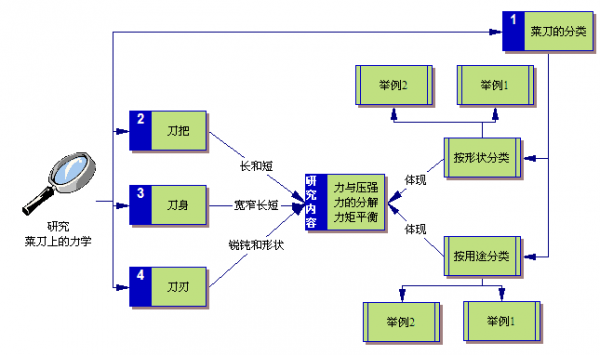

图12“研究性学习：菜刀上的力学”概念图

###思考的工具

思考的过程容易混乱，那么如何避免，如何才能使思考过程有条不紊，图13是一个例子，对于分数的加法，按照图中的步骤导引进行思考，则对应学生特别初学者不仅是帮助，更是引导思维过程。

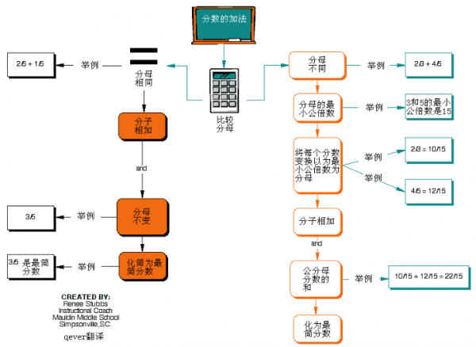

图13“分数加法”概念图

###搭建学习“脚手架”

建构性学习的特点就是要在适当的时候给学生搭建“脚手架”，协助学生克服学习困难，不是教师交给学生要记住什么，重要的是让学生按照脚手架的提示自己发现和探索什么。概念图是一种搭建脚手架的好工具。如图14所示，就是为了引导学生发现“弹簧振子”的运动特点的脚手架，学生按照这种方式进行思考，突破了传统的教学方式，得到如图所示的结果，教学效果不错。

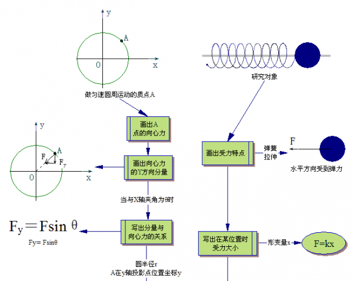

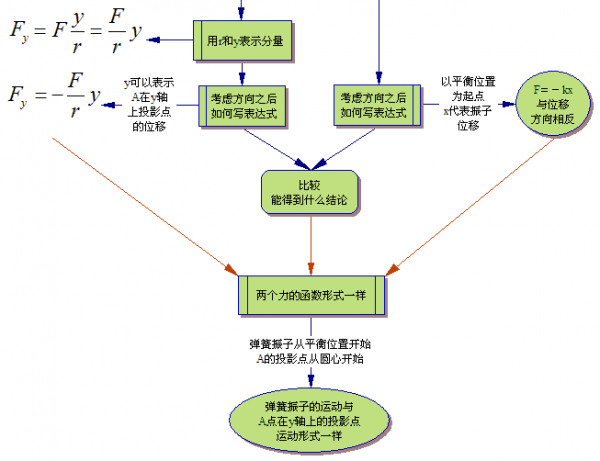

图15学生依据脚手架的探索结果，中间部分是教师搭建的“脚手架”，两侧是学生的探究结果图15学生依据脚手架的探索结果，中间部分是教师搭建的“脚手架”，两侧是学生的探究结果

##6．形成性评价的有效工具

教学评价一直是我们探索的内容之一，传统的以分数为标准的结果性评级有着天然的弊端，作为补充形式，形成性评价越来越受到教师们的重视了。很多实践探索表明概念图能够作为形成性评价的有效工具。

- 教师通过观察学生设计概念图的构图过程，了解其学习进展和内心思维活动的情况，以便给出及时诊断，改进教学
- 也可以作为总结性评价的工具，它与传统的试题测试相比的优点在于概念图为教师和学生提供的考试结果，已经不仅仅使一个抽象的分数，而是学生头脑中关于知识结构的图示再现。
- 教师和学生可以清晰地了解学生学习的状况，从而有效地帮助学生认识自我。

概念图技术在教学中的应用远远不止上述几种形式，例如在个别辅导中的应用、在远程教育中的应用等，这里只是抛砖引玉，希望能够给对此感兴趣的老师提供一点资料。

---------------------------------------

为了便于读者阅读，可以在下面的地址获得本文的PDF文档

下载地址：[http://yunpan.cn/QphhW2cSHhi7M](http://yunpan.cn/QphhW2cSHhi7M) （访问密码：ae54）

